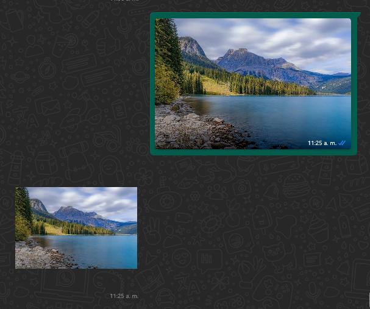

# WhatsApp Bot

[](https://developer.mozilla.org/en-US/docs/Web/JavaScript)
[](https://nodejs.org/)
[](https://expressjs.com/)
[](https://github.com/pedroslopez/whatsapp-web.js)
[](https://www.npmjs.com/package/qrcode-terminal)
[](https://www.npmjs.com/package/mime-types)


This is a WhatsApp bot created in JavaScript.

## Functionalities:

### 1. Image to Sticker Conversion

This functionality allows users to easily convert images into stickers for sharing and fun interactions on WhatsApp:

<p align="center">
  
</p>

## Installation

1. Clone this repository to your local machine:

   ```bash
   git clone https://github.com/pablo736/whatsapp-bot.git
   ```

2. Navigate to the project folder:

   ```bash
   cd WhatsApp-Bot
   ```

3. Install the project dependencies:

   ```bash
   npm install
   ```

## Usage

1. Start the bot by running the following command:

    ```bash
   npm start
   ```

2. Scan the QR code with your mobile device using WhatsApp to access WhatsApp Web.

## License
This project is licensed under the GNU General Public License v2.0. See the `LICENSE` file for more details.